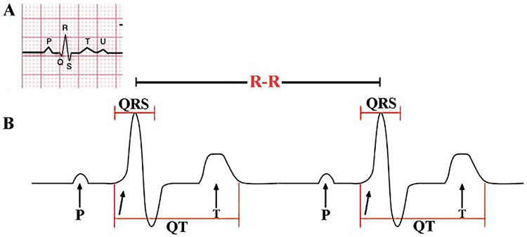

# **The heart rate variability in Borderline Personality Disorder** : Python and R project template for Master's internship in human movement sciences

-----

Estelle THOMAS
Master 2 REHAB, Faculty of Medicine, Montpellier, France

# **1. Scientific question**

## **1.1. Introduction**
Borderline Personality Disorder (BPD) is a severe, chronic, and disabling psychiatric condition characterized by instability of self-image, emotional dysregulation, unstable interpersonal relationships, and marked impulsivity, with a prevalence estimated at 2–6% in the general population and up to 20% in psychiatric settings (Ducasse et al., 2020). 
BPD is associated with high morbidity and mortality, partly driven by pathophysiological mechanisms involving HPA-axis hyperactivation, chronic low-grade inflammation, and autonomic nervous system dysregulation (Bozzatello et al., 2024).    

Heart rate variability (HRV) serves as a non-invasive index of autonomic nervous system balance: higher resting HRV reflects greater parasympathetic (vagal) activity and better self-regulatory capacity, while reduced HRV signals sympathetic predominance and impaired emotion regulation (Thayer & Lane, 2000). 
A meta-analysis confirmed significantly lower resting-state vagally-mediated HRV in individuals with BPD compared to healthy controls (Koenig et al., 2016), supporting the hypothesis that autonomic dysfunction underlies the emotional instability characteristic of the disorder.       

What I am looking for: I compare resting-state RMSSD between individuals with BPD and healthy controls as a psychophysiological marker of autonomic dysregulation.       

## **1.2. Aim**
The aim of this study is to examine whether resting-state heart rate variability (RMSSD) is significantly different between individuals with Borderline Personality Disorder and healthy controls.      

## **1.3. Method**
I equipped each participant with a heart rate monitor (Polar H10) for 5 minutes at rest.     
RR intervals were recorded using the Elite HRV application.  

I computed RMSSD from these 5-minute resting RR interval recordings using NeuroKit2 (Makowski et al., 2021), in accordance with the standards established by the Task Force of the ESC and NASPE (1996).     

## **1.4. Participants**   
- BPD patients (BPD): 32   
- Healthy controls (CON): 23       

## **1.5. Outcome measure**
`HRV = RMSSD` (Root Mean Square of Successive Differences)  

$RMSSD = \sqrt{\frac{1}{N-1} \sum_{i=1}^{N-1} (RR_{i+1} - RR_i)^2}$

*where $RR_i$ is the $i^{th}$ RR interval and $N$ is the total number of intervals.*

# **2. Python project**     

## **2.1. Aim**    
In the Python project, I transform RR interval data from text format into RMSSD values for each participant, producing a dataset suitable for statistical analysis in R.

## **2.2. Data organization**    
data folder contains the raw RR interval data for each participant in text format, organized as follows:

BPD folder contains `PXX_BPD.txt` files for each participant with BPD
CONTROL folder contains `PXX_CON.txt` files for each healthy control participant

In each file, one column contains RR intervals in milliseconds.
`HRV_results.xlsx` — output file saved in the results folder:

- `ID`: pseudonymized participant identifier
- `Group`: group membership (BPD or CON)
- `HRV_RMSSD`: RMSSD value computed for each participant

### **2.3. Notebook organization**    
`estelle_thomas.ipynb`:

- **Aim**: I compute RMSSD for each participant from raw RR interval recordings.
- **Input**: PXX_BPD.txt and PXX_CON.txt files in data/BPD and data/CONTROL folders
- **Processing**: I remove RR interval artifacts following Task Force ESC/NASPE (1996) standards, then compute RMSSD using nk.hrv_time() from NeuroKit2 (Makowski et al., 2021)
- **Output**: HRV_results.xlsx saved in results folder: one RMSSD value per participant

   
### **2.4. Results**    
Finally, I obtain a dataframe with the RMSSD value for each participant, which I use as input for the statistical analysis in R.

# **3. R project**

## **3.1. Aim**
In the R project, I compare resting-state RMSSD between BPD patients and healthy controls using a non-parametric statistical test, and I quantify the magnitude of the group difference.

## **3.2. Data organisation**

File : `Python_project/resuls/HRV_results.xlsx`   
Columns :
  - `ID` : pseudonymized participant identifier.   
  - `Group` : group of participant(BPD or CON).      
  - `HRV_RMSSD` : RMSSD value for each participant.     
  
## **3.3. Script organization**  

### **3.3.1. Data loading and cleaning**

- **Aim**: I load the HRV dataset and remove inconsistencies.
- **Input**: HRV_results.xlsx
- **Processing**: I remove empty rows, deduplicate entries (same ID and same group), and verify data types
- **Output**: Clean dataframe hrv

### **3.3.2. Descriptive statistics**

- **Aim**: I describe the distribution of RMSSD in each group.
- **Input**: hrv
- **Output**: Mean, standard deviation, median, IQR, and n per grouproup

### **3.3.3. Visualization**

- **Aim**: I visualize the distribution of RMSSD by group.
- **Input**: hrv
- **Output**: boxplot_RMSSD_by_Group.png saved in results folder

### **3.3.4. Normality test**

- **Aim**: I determine whether parametric or non-parametric testing is appropriate.
- **Input**: hrv
- **Calculation**: I apply the Shapiro-Wilk test separately to each group
- **Output**: If both groups pass normality (p > 0.05): t-test; otherwise: Wilcoxon rank-sum test

### **3.3.5. Statistical test**: Wilcoxon rank-sum test

- **Aim**: I compare RMSSD between BPD and healthy controls.
- **Input**: hrv
- **Calculation**:

  $W = \sum_{i=1}^{n_1} R_i$

*where \(R_i\) represents the rank of each observation in the first group, and \(n_1\) is the sample size of this group.*

This non-parametric test was selected because RMSSD values were not normally distributed across groups.

### **3.3.6. Effect size**: rank-biserial correlation r

- **Aim**: I quantify the magnitude of the group difference, independent of sample size.
- **Input**: hrv

The rank-biserial correlation was computed as an effect size associated with the Wilcoxon rank-sum test.

- **Calculation**:

  $r_{rb} = \frac{2W}{n_1 n_2} - 1$

*where \(W\) is the Wilcoxon statistic, and \(n_1\) and \(n_2\) are the sample sizes of each group.*

- **Output**: r value and interpretation of effect size magnitude

Finally, in this R project, I will obtain a table with the results of the statistical analysis (e.g., p-value, effect size, etc.) and a figure showing the comparison between the two groups.    

## **3.4. Conclusion**    
In this study, I compared resting-state RMSSD between individuals with Borderline Personality Disorder and healthy controls in order to explore autonomic nervous system functioning in BPD.    

- The results showed **significantly lower RMSSD values in the BPD group compared to healthy controls (W = 246, p = 0.037)**, suggesting reduced parasympathetic activity in individuals with BPD. 
- The rank-biserial correlation indicated a **moderate effect size (r = -0.332)**, supporting the presence of a meaningful group difference.    

These **findings are consistent with previous literature reporting reduced vagally mediated heart rate variability in BPD populations** (Koenig et al., 2016). Reduced RMSSD may reflect alterations in autonomic regulation that contribute to emotional dysregulation and impulsivity commonly observed in BPD.   

Although the sample size remains moderate and causal interpretations cannot be made, this study supports the relevance of HRV, and particularly RMSSD, as a potential psychophysiological marker associated with BPD.

# **4. Reference**   

Bozzatello, P., Marin, G., Gabriele, G., Brasso, C., Rocca, P., & Bellino, S. (2024). Metabolic dysfunctions, dysregulation of the autonomic nervous system, and echocardiographic parameters in borderline personality disorder: A narrative review. International Journal of Molecular Sciences, 25(22), 12286. https://doi.org/10.3390/ijms252212286. 

Ducasse, D., Lopez-Castroman, J., Dassa, D., Brand-Arpon, V., Dupuy-Maurin, K., Lacourt, L., & Olié, E. (2020). Exploring the boundaries between borderline personality disorder and suicidal behavior disorder. European Archives of Psychiatry and Clinical Neuroscience, 270, 959–967. https://doi.org/10.1007/s00406-019-01075-6.    

Koenig, J., Kemp, A. H., Feeling, N. R., Thayer, J. F., & Kaess, M. (2016). Resting state vagal tone in borderline personality disorder: A meta-analysis. Progress in Neuro-Psychopharmacology and Biological Psychiatry, 64, 18–26. https://doi.org/10.1016/j.pnpbp.2015.07.002.   

Makowski, D., Ben-Shachar, M. S., Pham, A. T., Lau, C., Brammer, M. J., & Chen, S. H. A. (2021). NeuroKit2: A Python toolbox for neurophysiological signal processing. Behavior Research Methods, 53, 1689–1696. https://doi.org/10.3758/s13428-020-01516-y.  

Task Force of the European Society of Cardiology and the North American Society of Pacing and Electrophysiology. (1996). Heart rate variability: Standards of measurement, physiological interpretation, and clinical use. Circulation, 93(5), 1043–1065.     

Thayer, J. F., & Lane, R. D. (2000). A model of neurovisceral integration in emotion regulation and dysregulation. Journal of Affective Disorders, 61(3), 201–216. https://doi.org/10.1016/S0165-0327(00)00338-4.   

